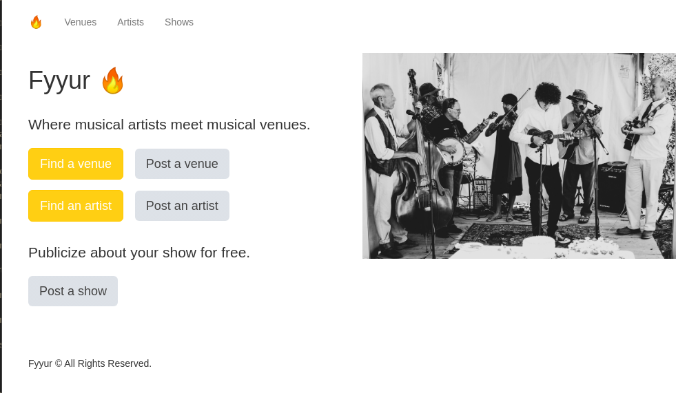
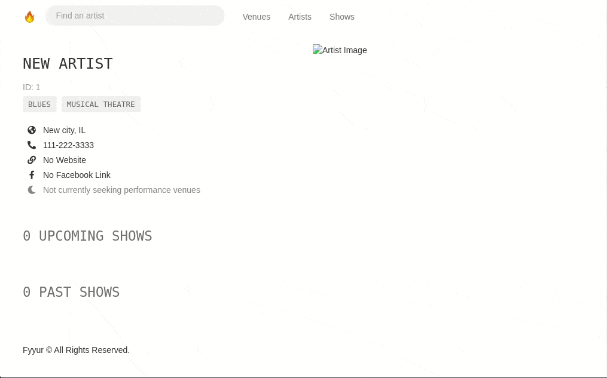
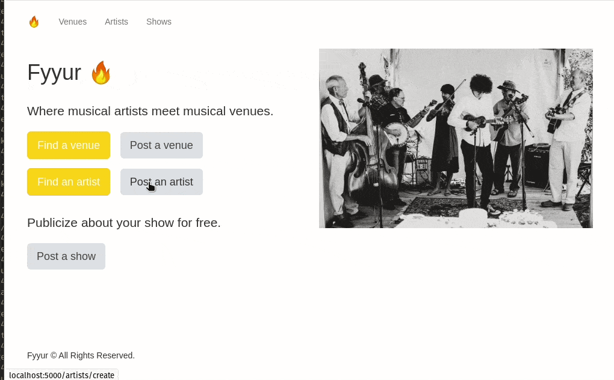
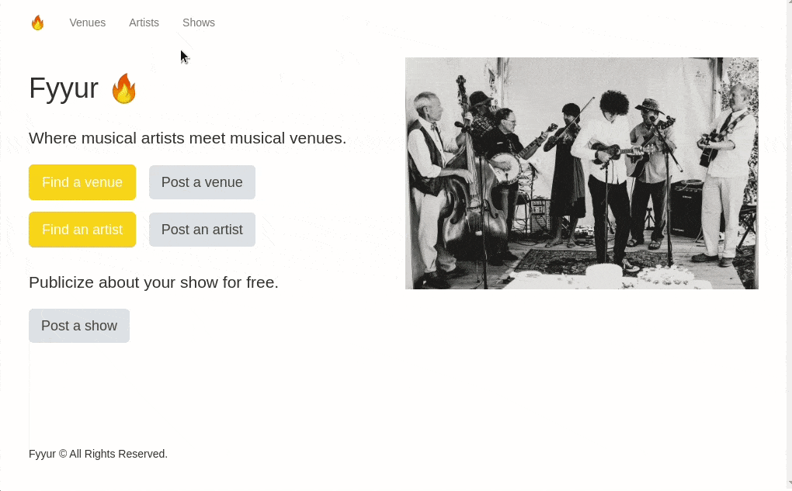
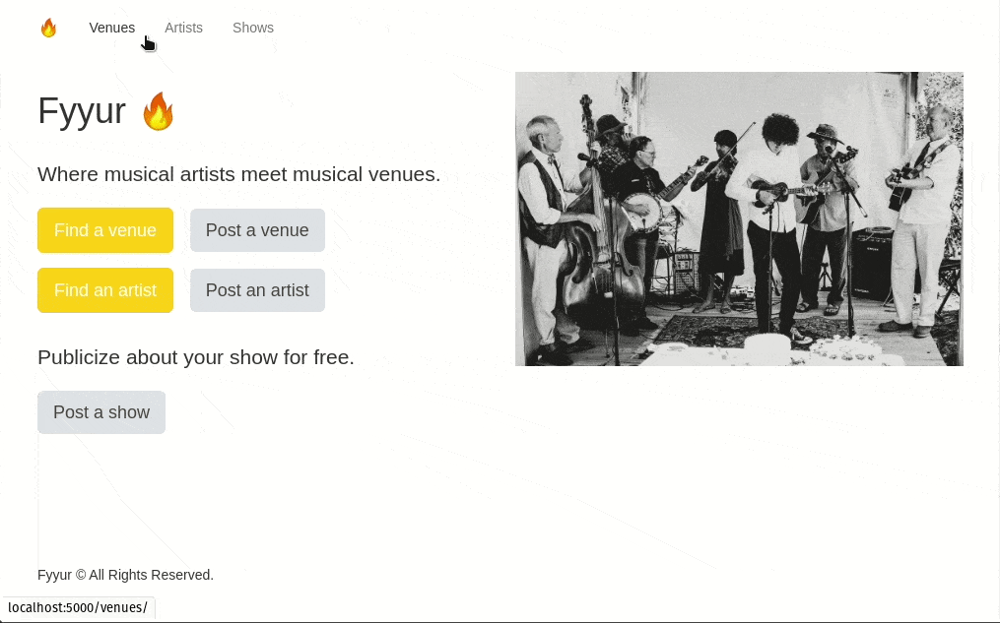
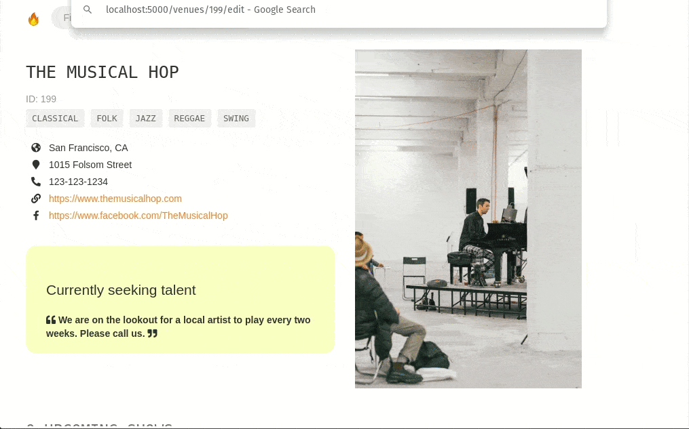
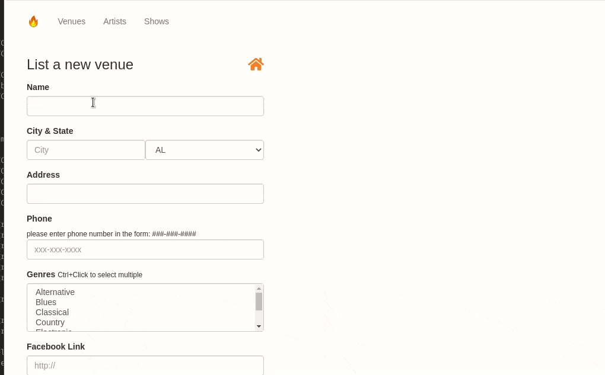
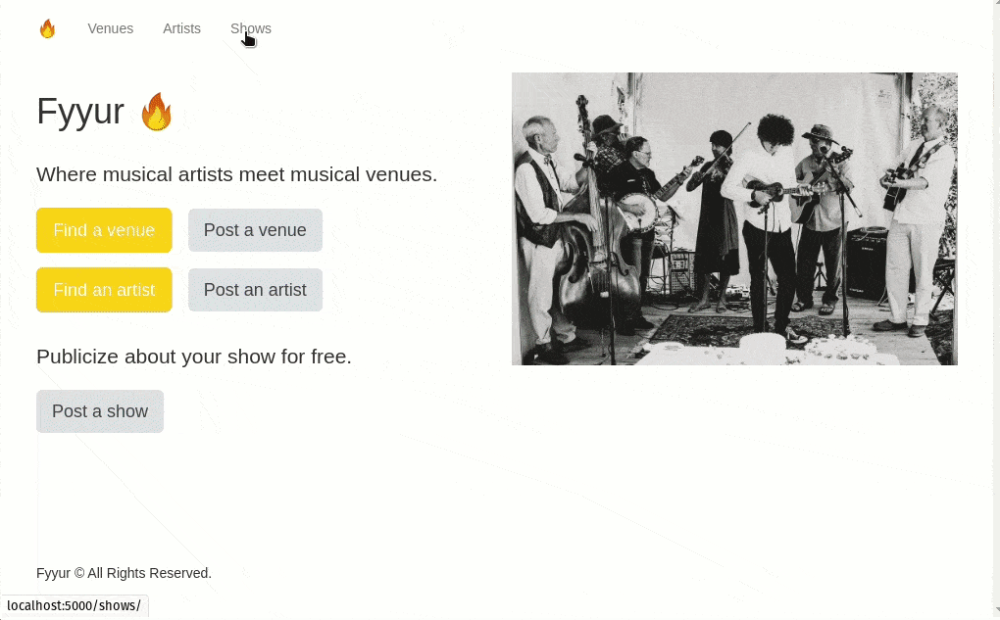
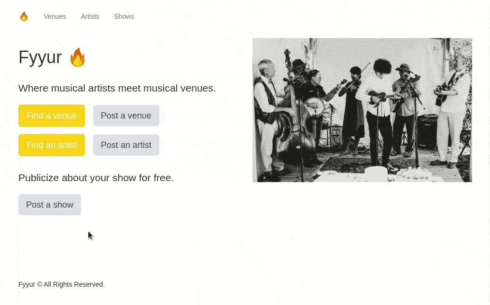

<br />
<p align="center">
    
  <h3 align="center">Fyyur</h3>
  <p align="center">
    Project 1 for Fullstack Nanodegree @ Udacity
  </p>
</p>

## Table of Contents

- [Table of Contents](#table-of-contents)
- [About The Project](#about-the-project)
  - [Built With](#built-with)
  - [Demo](#demo)
    - [Artists](#artists)
    - [Venues](#venues)
    - [Shows](#shows)
- [Getting Started](#getting-started)
  - [Prerequisites](#prerequisites)
  - [Installation](#installation)
  - [Test](#test)

## About The Project



Fyyur is a musical venue and artist booking site that facilitates the discovery and bookings of shows between local performing artists and venues. This site lets you list new artists and venues, discover them, and list shows with artists as a venue owner.


### Built With

- **virtualenv** as a tool to create isolated Python environments
- **SQLAlchemy ORM** to be our ORM library of choice
- **PostgreSQL** as our database of choice
- **Python3** and **Flask** as our server language and server framework
- **Flask-Migrate** for creating and running schema migrations


### Demo

Below is a demo for every implemented feature

#### Artists

- Artist List and Detail View
  <details>
    <summary>Click to expand!</summary>

    

  </details>

- Artist Search View
  <details>
    <summary>Click to expand!</summary>

    

  </details>

- Artist Edit View
  <details>
    <summary>Click to expand!</summary>

    

  </details>

- Artist Create View
  <details>
    <summary>Click to expand!</summary>

    

  </details>

#### Venues

- Venue List and Detail View
  <details>
    <summary>Click to expand!</summary>

    

  </details>

- Venue Search View
  <details>
    <summary>Click to expand!</summary>

    

  </details>

- Venue Edit View
  <details>
    <summary>Click to expand!</summary>

    

  </details>

- Venue Create View
  <details>
    <summary>Click to expand!</summary>

    

  </details>

- Venue Delete View
  <details>
    <summary>Click to expand!</summary>

    

  </details>

#### Shows

- Show List View
  <details>
    <summary>Click to expand!</summary>

    

  </details>

- Show Create View
  <details>
    <summary>Click to expand!</summary>

    

  </details>

## Getting Started

To get a local copy up and running follow these simple steps.

### Prerequisites

- Docker
- docker-compose

Follow [this guide](https://docs.docker.com/compose/install/) to learn how to install them


### Installation

- just use the following command to get the application to start

```sh
 make
 ```

### Test

- just use the following command to run the unittests

```sh
 make test
 ```

you should see the following

```
❯ make test
docker-compose run --service-ports --rm python nosetests -sv
Starting fyuur_database_1 ... done
Test Artist Create: test that an artist can be created /artists/create ... ok
Test Artist Detail: test that all artist details are listed in /artists/<artist_id> ... ok
Test Artist Edit: test that an artist can be edited /artist/<artist_id>/edit ... ok
Test Artist List: test that all artists are listed in /artists/ ... ok
Test Artist Search: test that all matching artists are listed in /artist/search ... ok
Test Show Create: test that a show can be created /shows/create ... ok
Test Show List: test that all shows are listed in /shows/ ... ok
Test Venue Create: test that a venue can be created /venues/create ... ok
Test Venue Detail: test that all venue details are listed in /venues/<venue_id> ... ok
Test Venue Edit: test that a venue can be edited /venues/<venue_id>/edit ... ok
Test Venue List: test that all venues are listed in /venues/ ... ok
Test Venue Search: test that all matching venues are listed in /venues/search ... ok

----------------------------------------------------------------------
Ran 12 tests in 1.008s

OK
```
